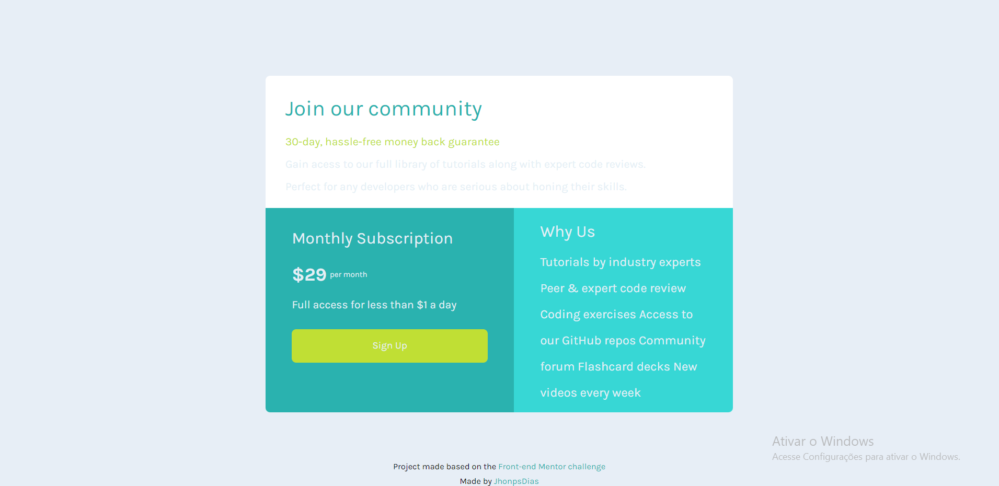

# Sigle Price Grid Component

Este é um desafio do site FrontEnd Mentor, baseado com o mesmo nome:

https://www.frontendmentor.io/challenges/single-price-grid-component-5ce41129d0ff452fec5abbbc/hub

Este projeto foi feito para estudo próprio, com aprendizagem da propriedade em CSS: FLEXBOX e GRID.

## Imagens do projeto

Desktop:

Mobile:

## Desafios que tive neste projeto:

O design do site no desktop foi particularmente mais fácil, conseguindo realizar ele em pouco tempo.
Mas o responsivo dele me deu trabalho, pois com o início dos estudos, não tenho muita prática nesta parte.
Nos final o design se assemelha um pouco com o que foi pedido.

## Tecnologias usadas:
- Html
- CSS

## Redes sociais
- <a href="https://github.com/JhonpsDias" target="_blank">GitHub</a>

- <a href="https://www.linkedin.com/in/jo%C3%A3o-pedro-dias-castro-a795a0295/" target="_blank">Linkedin</a>

Projeto feito por - <i>João Pedro Dias Castro</i>